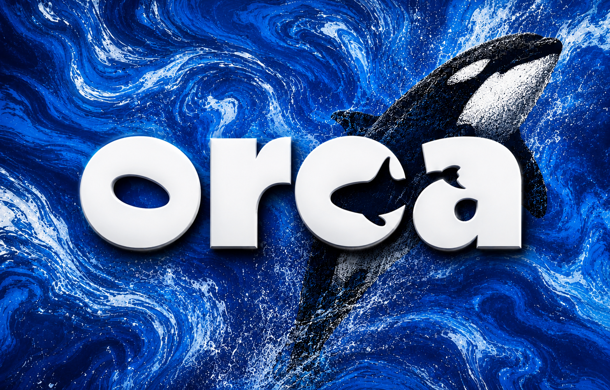
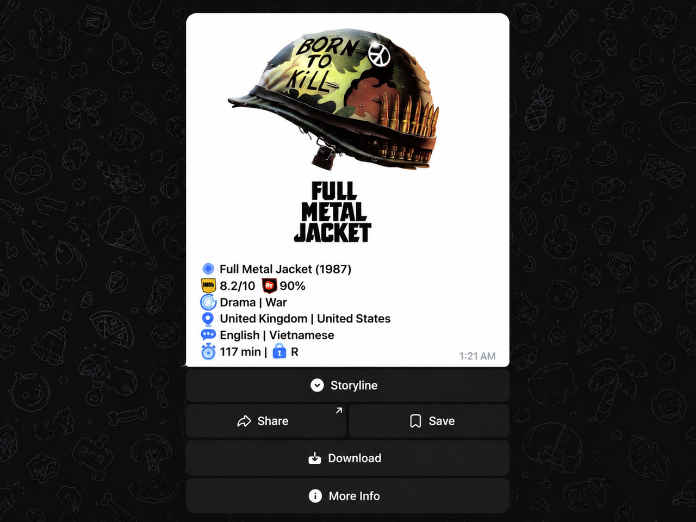

[**English Version**](./README.md) | [**نسخه فارسی**](./README_FA.md)

---
# ربات تلگرام اورکا موویز | Orca Movies

> ربات تلگرام فیلم و سریال: جستجو، نمره‌ها، لیست‌های منتخب و خبر قسمت‌ها و انتشارهای جدید.

---

## امتحانش کن

ربات روی تلگرامه — از اینجا بازش کن:

---

## درباره پروژه

**اورکا موویز (Orca Movies)** یه ربات تلگرامیه برای پیدا کردن و دنبال کردن فیلم و سریال.

جستجوش غلط املایی، فینگلیش و اسم فارسی/انگلیسی رو می‌فهمه. نمره‌های IMDb، راتن تومیتوز و متاکریتیک رو کنار هم نشونت میده. خلاصه‌ها خودشون به فارسی ترجمه میشن. کل ربات هم دوزبانه‌ست (فارسی/انگلیسی).

دکمه‌های منوی اصلی: جستجو، تصادفی، ترند، لیست‌ها، راهنما، ذخیره‌شده‌ها.

> کارت فیلم با پوستر، مشخصات و نمرات، داخل خود تلگرام:

---

## امکانات

### جستجو و مشخصات

* **مشخصات کامل:** پوستر، خلاصه داستان، تریلر، رده سنی، مدت زمان، ژانر، عوامل و فروش گیشه.
* **سه نمره کنار هم:** IMDb، راتن تومیتوز و متاکریتیک.
* **جستجوی راه‌بیا:** فقط اسم رو بفرست یا دکمه جستجو رو بزن — غلط تایپی، تلفظ نوشتاری و اسم‌های جایگزین رو می‌فهمه. دو حالت داره: عوامل (جستجو با اسم بازیگر/کارگردان) و پیشرفته (فیلتر ژانر، سال و نمره).
* **زیرنویس (`/sub`):** زبون رو انتخاب کن (فارسی/انگلیسی)، اسم رو بفرست، لینک دانلود رو بگیر.
* **فیلتر:** نتایج رو بر اساس ژانر، سال یا دهه، حداقل نمره و محبوبیت محدود کن.
* **پیشنهاد تصادفی:** یه فیلم یا سریال خوب از ژانر موردعلاقه‌ت.
* **ترند روز:** محبوب‌ترین عنوان‌های روز دنیا.
* **پروفایل عوامل:** بیوگرافی، تاریخ تولد و بهترین آثار هر بازیگر یا کارگردان.
* **حالت اینلاین:** تو هر چت و گروهی جستجو کن و کارت بفرست.

---

### لیست‌های منتخب

* **جدول‌های IMDb:** بهترین فیلم‌ها و سریال‌های تاریخ.
* **کالکشن‌های لترباکسد:** برترین فیلم‌ها، مستندها و انتخاب‌های موضوعی.
* **جوایز و فرنچایزها:** برندگان اسکار، دنیاهای سینمایی بزرگ و کالکشن‌های مشابه.
* **سریال بر اساس ژانر:** جنایی، جاسوسی، تریلر روان‌شناختی، کمتر دیده‌شده‌ها، سریال‌های طولانی و کلاسیک‌ها.
* **مرور:** تو لیست‌ها بچرخ یا هر عنوان رو با پوسترش باز کن.

---

### پیگیری انتشار

* **فیلم‌ها:** عنوان‌های آینده رو فالو کن، موقع انتشار خبرت می‌کنه.
* **سریال‌ها:** سریال‌های در حال پخش رو فالو کن، با هر قسمت جدید خبرت می‌کنه.

---

### شخصی‌سازی

* **دو زبون:** با یه لمس بین فارسی و انگلیسی جابه‌جا شو (راست‌به‌چپ کامل).
* **علاقه‌مندی‌ها:** عنوان‌ها رو ذخیره کن و بعداً پیداشون کن.
* **راهنما:** آموزش قدم‌به‌قدم جستجو، فالو، لیست‌ها و ذخیره‌شده‌ها داخل خود ربات.

---

## دستورات ربات

| دستور | توضیحات |
| :--- | :--- |
| `/start` | شروع ربات و نمایش منوی اصلی |
| `/random` | پیشنهاد تصادفی خوب بر اساس ژانر |
| `/sub` | جستجوی زیرنویس (فارسی / انگلیسی) |
| `/language` | عوض کردن زبون (فارسی / انگلیسی) |
| `/lists` | گشتن تو کالکشن‌های منتخب (دکمه لیست‌ها هم همینه) |
| `/help` | راهنمای قدم‌به‌قدم (دکمه راهنما هم همینه) |
| `@OrcaMoviesBot` | جستجو و فرستادن کارت در حالت اینلاین |

منوی تلگرام فقط این‌هاست: start، random، sub و language. برای جستجو فقط کافیه اسم رو بفرستی یا دکمه جستجو رو بزنی.

---

## زیرساخت فنی

* **سرورلس:** روی اج اجرا میشه، سروری برای مدیریت نیست.
* **جستجوی هوش مصنوعی:** جمله عادی رو می‌فهمه و عنوان رو از روی تلفظ پیدا می‌کنه.
* **چند منبع:** نمره و متادیتا از چند مرجع، بدون تکرار و با راستی‌آزمایی.
* **تطبیق با سال ساخت:** بازسازی‌ها و هم‌نام‌ها با هم قاطی نمیشن.
* **ذخیره‌سازی:** پروفایل، علاقه‌مندی‌ها و فالوها تو دیتابیس مدیریت‌شده.
* **جاب زمان‌بندی‌شده:** بررسی انتشارها و فرستادن اعلان خودش انجام میشه.
* **کش:** کش لبه سرعت پاسخ رو بالا نگه می‌داره.

---

## کلیدواژه‌ها

ربات فیلم تلگرام، ربات فیلم فارسی، جستجوی فیلم، نمرات imdb، دانلود زیرنویس، پیگیری سریال، ترند فیلم.

---

## سلب مسئولیت

نمونه‌کار نرم‌افزاری. همه متادیتا، پوسترها و عکس‌های فیلم‌ها مال صاحبان حقوق و دیتابیس‌های بازیه که ازشون گرفته شده.
